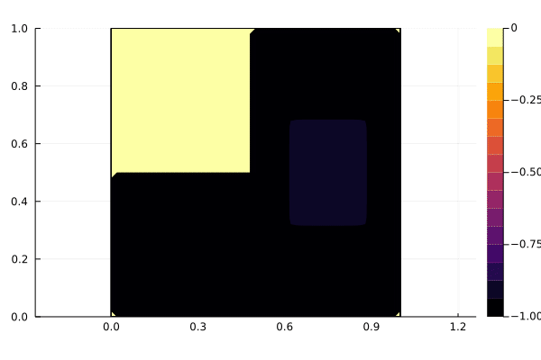

## MAM4 - EDP1
# Équations aux dérivées partielles 1
# 2025-26

[Discussions](https://github.com/pns-mam/edp1/discussions/1)

[Plan du cours](cm/cm.md)

[TD 1](td1/td1.pdf)

[TP 1 - Advection](tp1/tp1.md)

[TP 2 - Chaleur](tp2/tp2.md)

[Exam CC 1 (2024-25)](exam-cc1-old/exam-cc1-corr.pdf)

[Exam CC 2 (2024-25)](exam-cc2-old/exam-cc2.pdf)

# Bibliographie
[Allaire, G. Approximation numérique et optimisation. École Polytechnique, 2019. cel-02168288](https://hal.science/cel-02168288/document)

# Évaluation
2 exams CC (tous coeff. 1)

# Organisation
- 9 séances de CM
- 9 séances de TD

# Intervenants
- [J.-B. Caillau](mailto:jean-baptiste.caillau@univ-cotedazur.fr) (CM et TD)
- [L. Sacchelli](mailto:ludovic.sacchelli@univ-cotedazur.fr) (TD)
- Remerciements à [V. Dolean](https://www.tue.nl/en/research/researchers/victorita-dolean-maini) pour certains textes de TD / TP