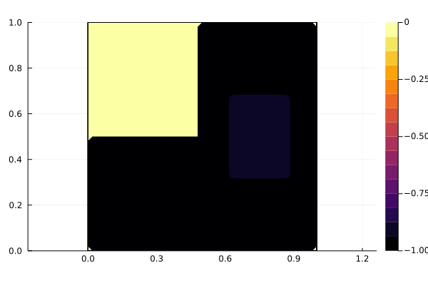

## MAM4 - EDP1
# Équations aux dérivées partielles 1
# 2024-25

[Discussions](https://github.com/pns-mam/edp1/discussions/1)

[Plan du cours](cm/cm.md)

[TD 1 - Équation des ondes](td6/td6.pdf)

[Exam CC 1 (2023-24)](exam-cc1-old/exam-cc1.pdf)
([corrigé](exam-cc1/exam-cc1-corr.pdf))

[Exam CC 2 (2023-24)](exam-cc2/exam-cc2.md)

# Bibliographie
[Allaire, G. Approximation numérique et optimisation. École Polytechnique, 2019. cel-02168288](https://hal.science/cel-02168288/document)

# Évaluation
2 exams CC (tous coeff. 1)

# Organisation
- 9 séances de CM
- 9 séances de TD

# Intervenants
- [J.-B. Caillau](mailto:jean-baptiste.caillau@univ-cotedazur.fr) (CM et TD)
- [C. Simeoni](mailto:chiara.simeoni@univ-cotedazur.fr) (TD)